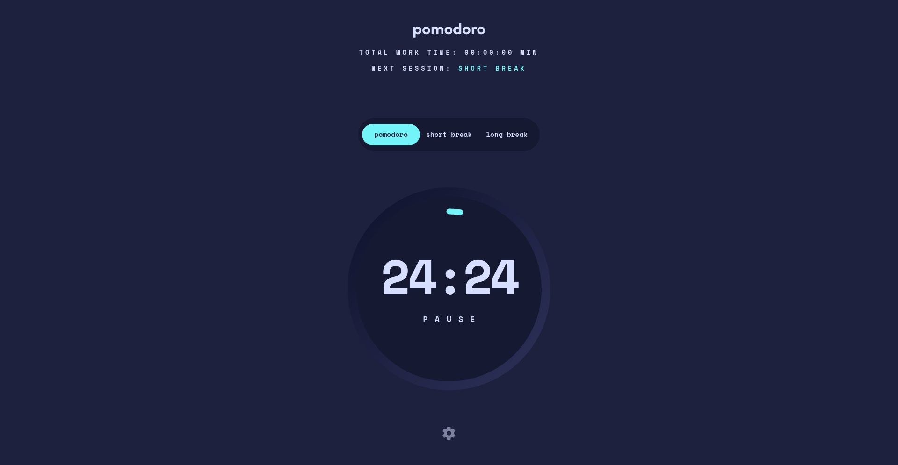
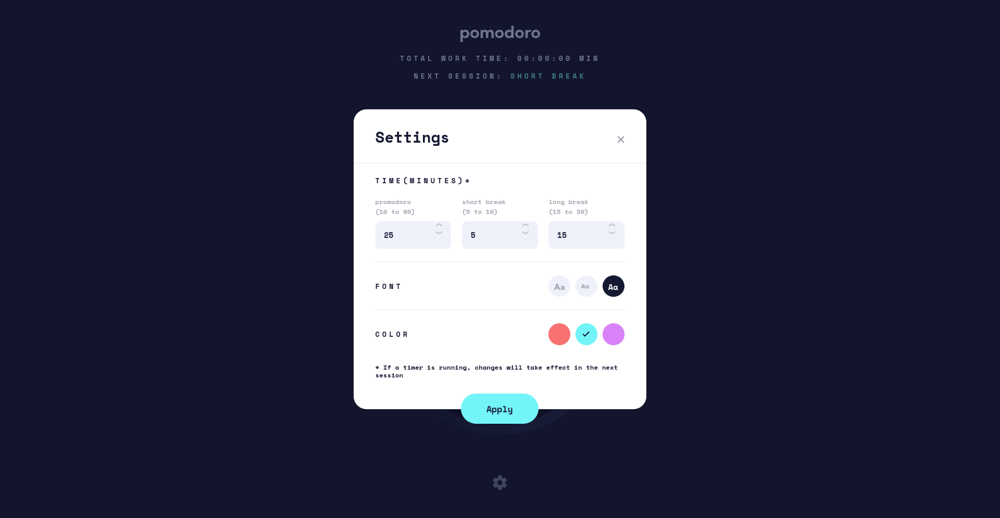
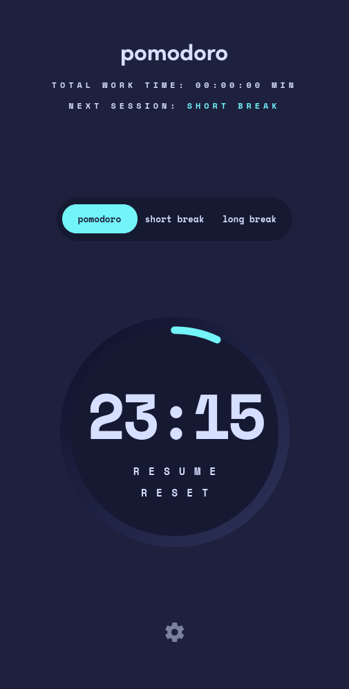
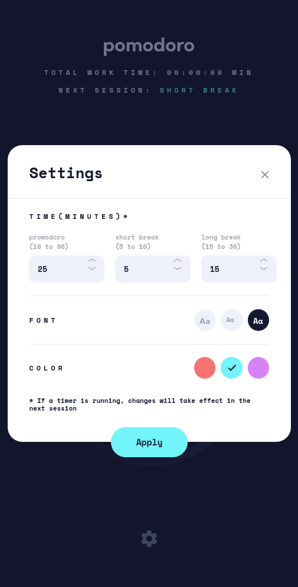

# Frontend Mentor - Pomodoro app solution

This is a solution to the [Pomodoro app challenge on Frontend Mentor](https://www.frontendmentor.io/challenges/pomodoro-app-KBFnycJ6G). Frontend Mentor challenges help you improve your coding skills by building realistic projects.

## Table of contents

- [Overview](#overview)
  - [The challenge](#the-challenge)
  - [Screenshot](#screenshot)
  - [Links](#links)
- [My process](#my-process)
  - [Built with](#built-with)
  - [What I learned](#what-i-learned)
  - [Added Features](#added-features)
  - [Useful resources](#useful-resources)
- [Author](#author)

## Overview

### The challenge

Users should be able to:

- Set a pomodoro timer and short & long break timers
- Customize how long each timer runs for
- See a circular progress bar that updates every minute and represents how far through their timer they are
- Customize the appearance of the app with the ability to set preferences for colors and fonts

### Screenshot

### Links

- Live Site URL: [Promodoro App](https://another-promodoro-app.netlify.app/)

## My process

- Building the app and making sure it's responsive
- Adding basic functionality to the app
- Working on the setting modules as a last step

### Built with

- Semantic HTML5 markup
- CSS custom properties
- CSS Flexbox & Grid
- SASS
- Vanilla JavaScript

### What I learned

- SVG animated path
- JavaScript modules and basic use of Parcel
- Changing CSS custom properties with JS

### Added Features

- Total work time: Showing the total hours and minutes done (promodoros)
- Next session: To inform the user of the upcoming session
- Reset button: Reset everything and start all over (erasing total work hours and promodoro counts)
- LocalStorage: Saving the user settings and timers in the browser storage

### Useful resources

- [Animated line drawing in SVG](https://jakearchibald.com/2013/animated-line-drawing-svg/) - This helped me to animate the progress ring

## Author

- Frontend Mentor - [@faissalabsml](https://www.frontendmentor.io/profile/faissalabsml)
- Twitter - [@faissalabs](https://twitter.com/faissalabs)
